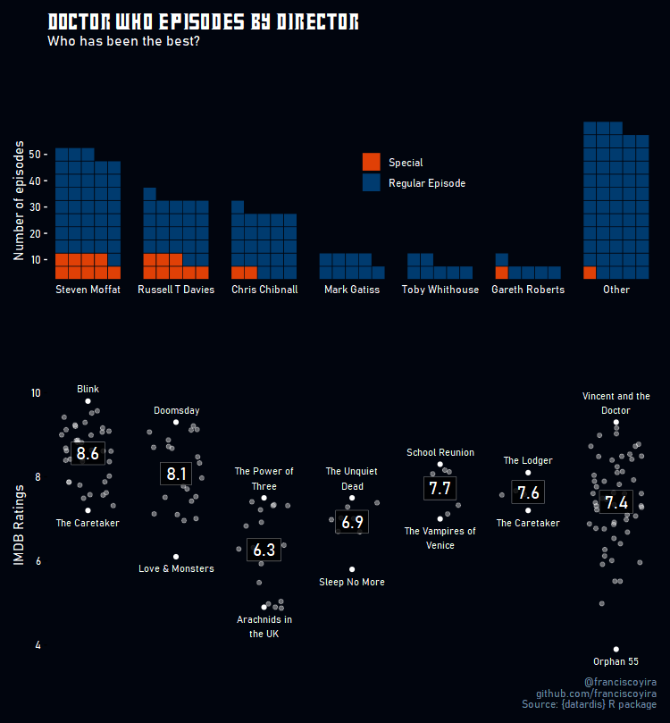

# tidytuesday
My contributions to [#TidyTuesday](https://github.com/rfordatascience/tidytuesday), a project run by the R Community consisting of weekly challenges to clean and visualise public datasets.

## Featured

### Doctor Who episodes (2021, week 48)

Visualisation of IMDB data about Doctor Who episodes, showing the number of episodes and distribution of ratings by director. This plot uses custom `ggplot` themes and fonts to match Doctor Who's TV show aesthetic. The data for this specific contribution was made available through the package [`datardis`](https://cran.r-project.org/web/packages/datardis/index.html).

Code: [R Notebook](https://franciscoyira.github.io/tidytuesday/contributions/2021_48_ggplot_doctor_who.nb)
