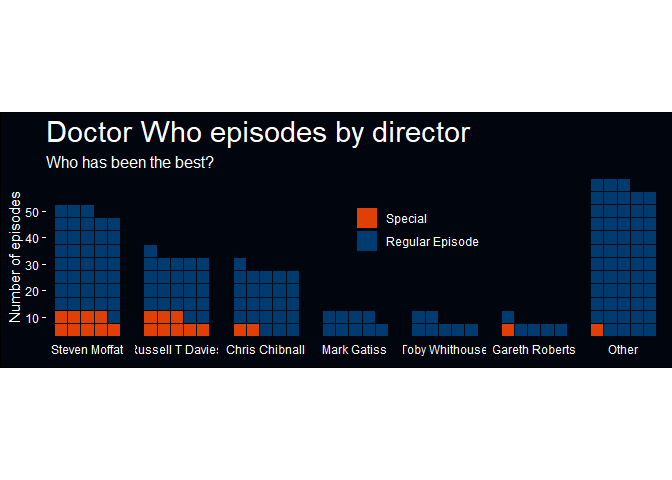
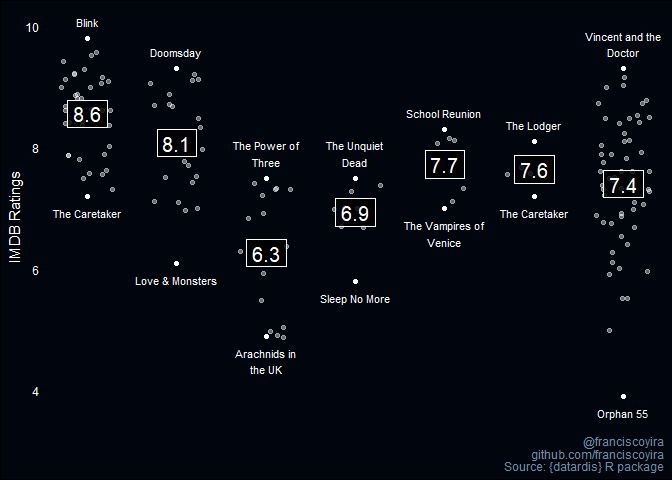
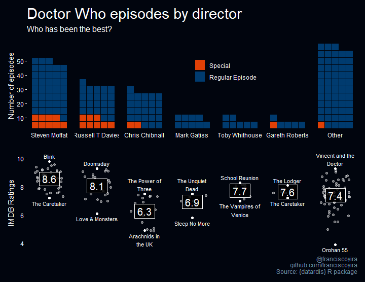

TidyTuesday 2021-11-23
================

Link for downloading the Doctor Who font:
<https://fontmeme.com/fuentes/fuente-doctor-who/>

``` r
# Loading packages and data
library(tidyverse)
library(waffle)
library(patchwork)

tuesdata <- tidytuesdayR::tt_load('2021-11-23')
```

    ## 
    ##  Downloading file 1 of 4: `writers.csv`
    ##  Downloading file 2 of 4: `directors.csv`
    ##  Downloading file 3 of 4: `episodes.csv`
    ##  Downloading file 4 of 4: `imdb.csv`

``` r
episodes <- tuesdata$episodes
writers <- tuesdata$writers
imdb <- tuesdata$imdb
directors <- tuesdata$directors

setwd(here::here())
```

Examining the distribution of episodes by director

``` r
writers %>% count(writer, sort = TRUE)
```

    ## # A tibble: 36 x 2
    ##    writer               n
    ##    <chr>            <int>
    ##  1 Steven Moffat       48
    ##  2 Russell T Davies    31
    ##  3 Chris Chibnall      26
    ##  4 Mark Gatiss          9
    ##  5 Toby Whithouse       7
    ##  6 Gareth Roberts       6
    ##  7 Helen Raynor         4
    ##  8 Jamie Mathieson      4
    ##  9 Peter Harness        4
    ## 10 Matthew Graham       3
    ## # ... with 26 more rows

Manipulating the data to get the amount of episodes from the 5 directors
with most episodes, and grouping everybody else in “Other”.

``` r
# Episodes by type
episodes_by_type <- 
  episodes %>% 
  select(story_number, type) %>% 
  mutate(type = ifelse(type == "episode", "Regular Episode", "Special"),
         type = fct_relevel(type, "Special", "Regular Episode"))

  
df_eps_writers <- 
  writers %>% 
  left_join(episodes_by_type) %>% 
  mutate(writer = fct_lump_n(writer, n = 6)) %>% 
  count(writer, type) %>% 
  mutate(writer = fct_reorder(writer, n, .fun = sum, .desc = TRUE),
         writer = fct_relevel(writer, "Other", after = Inf)) %>% 
  ungroup()
```

    ## Joining, by = "story_number"

``` r
df_eps_writers
```

    ## # A tibble: 12 x 3
    ##    writer           type                n
    ##    <fct>            <fct>           <int>
    ##  1 Chris Chibnall   Special             2
    ##  2 Chris Chibnall   Regular Episode    24
    ##  3 Gareth Roberts   Special             1
    ##  4 Gareth Roberts   Regular Episode     5
    ##  5 Mark Gatiss      Regular Episode     9
    ##  6 Russell T Davies Special             8
    ##  7 Russell T Davies Regular Episode    23
    ##  8 Steven Moffat    Special             9
    ##  9 Steven Moffat    Regular Episode    39
    ## 10 Toby Whithouse   Regular Episode     7
    ## 11 Other            Special             1
    ## 12 Other            Regular Episode    57

Creating the waffle plot of total episodes by director:

``` r
# Defining breaks for Y axis
max_value_y_axis <- max(df_eps_writers$n)  %/% 5
seq_breaks <- seq(0, max_value_y_axis, by = 2)

plot_waffle <- 
  ggplot(df_eps_writers) +
  waffle::geom_waffle(aes(fill = type, values = n),
                      color = "#01050e", size = 0.25, n_rows = 5, flip = TRUE) +
  facet_wrap(~writer, nrow = 1, strip.position = "bottom") +
  scale_x_discrete() +
  scale_y_continuous(labels = function(x) x * 5, #this should be the same as n_rows
                     breaks = seq_breaks,
                     expand = c(0, 0),
                     name = "Number of episodes") +
  coord_equal() +
  scale_fill_manual(name = NULL,
                    values = c("Regular Episode" = "#003b6f",
                               "Special" = "#e04006")) +
  theme_minimal(base_family = "Bahnschrift") +
  theme(panel.grid = element_blank(),
        axis.ticks.y = element_line(color = "white"),
        legend.position = c(0.6, 0.7),
        plot.title = element_text(family = "Doctor Who", size = 22,
                                  color = "white", face = "plain"),
        plot.subtitle = element_text(size = 12,
                                  color = "white", face = "plain"),
        plot.background  = element_rect(fill = '#01050e'),
        axis.title.y = element_text(color = "white"),
        axis.text = element_text(color = "white"),
        strip.text = element_text(color = "white"),
        legend.text = element_text(color = "white")
        ) +
  labs(title = "Doctor Who episodes by director",
       subtitle = "Who has been the best?")
  
plot_waffle
```

    ## Warning in grid.Call(C_stringMetric, as.graphicsAnnot(x$label)): font family not
    ## found in Windows font database

    ## Warning in grid.Call(C_stringMetric, as.graphicsAnnot(x$label)): font family not
    ## found in Windows font database

    ## Warning in grid.Call(C_textBounds, as.graphicsAnnot(x$label), x$x, x$y, : font
    ## family not found in Windows font database

    ## Warning in grid.Call(C_stringMetric, as.graphicsAnnot(x$label)): font family not
    ## found in Windows font database

    ## Warning in grid.Call(C_stringMetric, as.graphicsAnnot(x$label)): font family not
    ## found in Windows font database

    ## Warning in grid.Call(C_textBounds, as.graphicsAnnot(x$label), x$x, x$y, : font
    ## family not found in Windows font database

    ## Warning in grid.Call(C_textBounds, as.graphicsAnnot(x$label), x$x, x$y, : font
    ## family not found in Windows font database

    ## Warning in grid.Call(C_textBounds, as.graphicsAnnot(x$label), x$x, x$y, : font
    ## family not found in Windows font database

    ## Warning in grid.Call(C_textBounds, as.graphicsAnnot(x$label), x$x, x$y, : font
    ## family not found in Windows font database

    ## Warning in grid.Call(C_textBounds, as.graphicsAnnot(x$label), x$x, x$y, : font
    ## family not found in Windows font database

    ## Warning in grid.Call(C_textBounds, as.graphicsAnnot(x$label), x$x, x$y, : font
    ## family not found in Windows font database

    ## Warning in grid.Call.graphics(C_text, as.graphicsAnnot(x$label), x$x, x$y, :
    ## font family not found in Windows font database

    ## Warning in grid.Call(C_textBounds, as.graphicsAnnot(x$label), x$x, x$y, : font
    ## family not found in Windows font database

    ## Warning in grid.Call.graphics(C_text, as.graphicsAnnot(x$label), x$x, x$y, :
    ## font family not found in Windows font database

    ## Warning in grid.Call(C_textBounds, as.graphicsAnnot(x$label), x$x, x$y, : font
    ## family not found in Windows font database

    ## Warning in grid.Call(C_textBounds, as.graphicsAnnot(x$label), x$x, x$y, : font
    ## family not found in Windows font database

    ## Warning in grid.Call(C_textBounds, as.graphicsAnnot(x$label), x$x, x$y, : font
    ## family not found in Windows font database

<!-- -->

Another plot: IMDB ratings by director. Joining and manipulating to get
the scores associated to the directors, and the average score by
director.

``` r
episodes2 <- 
  episodes %>% 
  select(story_number, type, season_number, episode_number, episode_title)

epi_writ_imdb <- 
  writers %>% 
  left_join(episodes2) %>% 
  left_join(imdb,
            by = c("season_number" = "season",
                   "episode_number" = "ep_num")) %>% 
  mutate(writer = fct_lump_n(writer, n = 6),
         writer = fct_reorder(writer, rep(1, n()), .fun = sum, .desc = TRUE),
         writer = fct_relevel(writer, "Other", after = Inf))
```

    ## Joining, by = "story_number"

``` r
rat_by_writer <- 
  epi_writ_imdb %>% 
  group_by(writer) %>% 
  summarise(avg_rating = mean(rating, na.rm = TRUE))

rat_by_writer
```

    ## # A tibble: 7 x 2
    ##   writer           avg_rating
    ##   <fct>                 <dbl>
    ## 1 Steven Moffat          8.56
    ## 2 Russell T Davies       8.08
    ## 3 Chris Chibnall         6.27
    ## 4 Mark Gatiss            6.93
    ## 5 Toby Whithouse         7.73
    ## 6 Gareth Roberts         7.64
    ## 7 Other                  7.40

Creating the dataframe with the best and worst episode by director

``` r
best_and_worst <- 
  epi_writ_imdb %>% 
  filter(complete.cases(.)) %>% 
  group_by(writer) %>% 
  mutate(worst = row_number(rating) == 1,
         best = row_number(desc(rating)) == 1) %>% 
  filter(best | worst) %>% 
  mutate(rating_label = ifelse(best,
                               rating + 0.2,
                               rating - 0.2))

best_and_worst
```

    ## # A tibble: 14 x 13
    ##    story_number writer type  season_number episode_number episode_title air_date
    ##    <chr>        <fct>  <chr>         <dbl>          <dbl> <chr>         <chr>   
    ##  1 159          Mark ~ epis~             1              3 The Unquiet ~ 24 Mar.~
    ##  2 170          Toby ~ epis~             2              3 School Reuni~ 13 Oct.~
    ##  3 175          Russe~ epis~             2             10 Love & Monst~ 8 Dec. ~
    ##  4 177b         Russe~ epis~             2             13 Doomsday      22 Dec.~
    ##  5 186          Steve~ epis~             3             10 Blink         9 Jun. ~
    ##  6 207          Toby ~ epis~             5              6 The Vampires~ 8 May 2~
    ##  7 210          Other  epis~             5             10 Vincent and ~ 5 Jun. ~
    ##  8 211          Garet~ epis~             5             11 The Lodger    10 Jul.~
    ##  9 229          Chris~ epis~             7              4 The Power of~ 22 Sep.~
    ## 10 247          Garet~ epis~             8              6 The Caretaker 27 Sep.~
    ## 11 247          Steve~ epis~             8              6 The Caretaker 27 Sep.~
    ## 12 259          Mark ~ epis~             9              9 Sleep No More 14 Nov.~
    ## 13 280          Chris~ epis~            11              4 Arachnids in~ 28 Oct.~
    ## 14 289          Other  epis~            12              3 Orphan 55     12 Jan.~
    ## # ... with 6 more variables: rating <dbl>, rating_n <dbl>, desc <chr>,
    ## #   worst <lgl>, best <lgl>, rating_label <dbl>

Plot of distributions of IMDB scores by director:

``` r
data_plot <- epi_writ_imdb %>% 
  select(writer, rating, episode_title) %>% 
  anti_join(best_and_worst,
            by = c("writer", "rating", "episode_title"))

plot_best_worst <- 
  data_plot %>% 
  ggplot(aes(writer, y = rating)) +
  geom_point(alpha = 0.4,
             position = position_jitter(seed = 1989),
             color = "white") +
  geom_label(data = rat_by_writer,
             aes(writer, y = avg_rating, label = round(avg_rating, 1)),
             fill = "black",
             color = "white",
             size = 5.2,
             family = "Bahnschrift",
             label.r = unit(0, "lines"),
             label.size = 0.1,
             label.padding = unit(0.3, "lines"),
             alpha = 0.8) +
  geom_text(data = best_and_worst,
            family = "Bahnschrift",
            aes(y = rating_label, label = str_wrap(episode_title, 15)),
            size = 3,
            vjust = best_and_worst$worst,
            color = "white") +
  geom_point(data = best_and_worst,
             color = "white") +
  facet_wrap(~writer, nrow = 1, scales = "free_x") +
  scale_x_discrete(breaks = c(0.5, 1.5, 2.5)) +
  theme_minimal(base_family = "Bahnschrift") +
  theme(panel.grid.major.y = element_blank(),
        panel.grid.minor.y = element_blank(),
        axis.ticks.y = element_line(),
        axis.title.x = element_blank(),
        axis.text.x = element_blank(),
        strip.text.x = element_blank(),
        plot.background  = element_rect(fill = '#01050e'),
        axis.title.y = element_text(color = "white"),
        axis.text = element_text(color = "white"),
        strip.text = element_text(color = "white"),
        legend.text = element_text(color = "white"),
        plot.caption = element_text(color = "#6f8ea9")) +
   labs(y = "IMDB Ratings",
        caption = "@franciscoyira\ngithub.com/franciscoyira\nSource: {datardis} R package")

plot_best_worst
```

    ## Warning: Removed 28 rows containing missing values (geom_point).

    ## Warning in grid.Call(C_textBounds, as.graphicsAnnot(x$label), x$x, x$y, : font
    ## family not found in Windows font database

    ## Warning in grid.Call(C_textBounds, as.graphicsAnnot(x$label), x$x, x$y, : font
    ## family not found in Windows font database

    ## Warning in grid.Call(C_textBounds, as.graphicsAnnot(x$label), x$x, x$y, : font
    ## family not found in Windows font database

    ## Warning in grid.Call(C_textBounds, as.graphicsAnnot(x$label), x$x, x$y, : font
    ## family not found in Windows font database

    ## Warning in grid.Call(C_textBounds, as.graphicsAnnot(x$label), x$x, x$y, : font
    ## family not found in Windows font database

    ## Warning in grid.Call(C_textBounds, as.graphicsAnnot(x$label), x$x, x$y, : font
    ## family not found in Windows font database

    ## Warning in grid.Call.graphics(C_text, as.graphicsAnnot(x$label), x$x, x$y, :
    ## font family not found in Windows font database

    ## Warning in grid.Call(C_textBounds, as.graphicsAnnot(x$label), x$x, x$y, : font
    ## family not found in Windows font database

    ## Warning in grid.Call.graphics(C_text, as.graphicsAnnot(x$label), x$x, x$y, :
    ## font family not found in Windows font database

    ## Warning in grid.Call(C_textBounds, as.graphicsAnnot(x$label), x$x, x$y, : font
    ## family not found in Windows font database

    ## Warning in grid.Call.graphics(C_text, as.graphicsAnnot(x$label), x$x, x$y, :
    ## font family not found in Windows font database

    ## Warning in grid.Call(C_textBounds, as.graphicsAnnot(x$label), x$x, x$y, : font
    ## family not found in Windows font database

    ## Warning in grid.Call.graphics(C_text, as.graphicsAnnot(x$label), x$x, x$y, :
    ## font family not found in Windows font database

    ## Warning in grid.Call(C_textBounds, as.graphicsAnnot(x$label), x$x, x$y, : font
    ## family not found in Windows font database

    ## Warning in grid.Call.graphics(C_text, as.graphicsAnnot(x$label), x$x, x$y, :
    ## font family not found in Windows font database

    ## Warning in grid.Call(C_textBounds, as.graphicsAnnot(x$label), x$x, x$y, : font
    ## family not found in Windows font database

    ## Warning in grid.Call.graphics(C_text, as.graphicsAnnot(x$label), x$x, x$y, :
    ## font family not found in Windows font database

    ## Warning in grid.Call(C_textBounds, as.graphicsAnnot(x$label), x$x, x$y, : font
    ## family not found in Windows font database

    ## Warning in grid.Call.graphics(C_text, as.graphicsAnnot(x$label), x$x, x$y, :
    ## font family not found in Windows font database

    ## Warning in grid.Call(C_textBounds, as.graphicsAnnot(x$label), x$x, x$y, : font
    ## family not found in Windows font database

    ## Warning in grid.Call(C_textBounds, as.graphicsAnnot(x$label), x$x, x$y, : font
    ## family not found in Windows font database

    ## Warning in grid.Call.graphics(C_text, as.graphicsAnnot(x$label), x$x, x$y, :
    ## font family not found in Windows font database

    ## Warning in grid.Call(C_textBounds, as.graphicsAnnot(x$label), x$x, x$y, : font
    ## family not found in Windows font database

<!-- -->

Putting both plots together with patchwork:

``` r
combined_plot <- 
  (plot_waffle / plot_best_worst)

combined_plot <- 
  combined_plot &
  theme(plot.background  = element_rect(fill = '#01050e',
                                        color = '#01050e'))
```

``` r
combined_plot
```

    ## Warning in grid.Call(C_textBounds, as.graphicsAnnot(x$label), x$x, x$y, : font
    ## family not found in Windows font database

    ## Warning: Removed 28 rows containing missing values (geom_point).

    ## Warning in grid.Call(C_textBounds, as.graphicsAnnot(x$label), x$x, x$y, : font
    ## family not found in Windows font database

    ## Warning in grid.Call(C_textBounds, as.graphicsAnnot(x$label), x$x, x$y, : font
    ## family not found in Windows font database

    ## Warning in grid.Call(C_textBounds, as.graphicsAnnot(x$label), x$x, x$y, : font
    ## family not found in Windows font database

    ## Warning in grid.Call(C_textBounds, as.graphicsAnnot(x$label), x$x, x$y, : font
    ## family not found in Windows font database

    ## Warning in grid.Call(C_textBounds, as.graphicsAnnot(x$label), x$x, x$y, : font
    ## family not found in Windows font database

    ## Warning in grid.Call(C_textBounds, as.graphicsAnnot(x$label), x$x, x$y, : font
    ## family not found in Windows font database

    ## Warning in grid.Call(C_textBounds, as.graphicsAnnot(x$label), x$x, x$y, : font
    ## family not found in Windows font database

    ## Warning in grid.Call(C_textBounds, as.graphicsAnnot(x$label), x$x, x$y, : font
    ## family not found in Windows font database

    ## Warning in grid.Call.graphics(C_text, as.graphicsAnnot(x$label), x$x, x$y, :
    ## font family not found in Windows font database

    ## Warning in grid.Call.graphics(C_text, as.graphicsAnnot(x$label), x$x, x$y, :
    ## font family not found in Windows font database

    ## Warning in grid.Call(C_textBounds, as.graphicsAnnot(x$label), x$x, x$y, : font
    ## family not found in Windows font database

    ## Warning in grid.Call(C_textBounds, as.graphicsAnnot(x$label), x$x, x$y, : font
    ## family not found in Windows font database

    ## Warning in grid.Call(C_textBounds, as.graphicsAnnot(x$label), x$x, x$y, : font
    ## family not found in Windows font database

    ## Warning in grid.Call.graphics(C_text, as.graphicsAnnot(x$label), x$x, x$y, :
    ## font family not found in Windows font database

    ## Warning in grid.Call(C_textBounds, as.graphicsAnnot(x$label), x$x, x$y, : font
    ## family not found in Windows font database

    ## Warning in grid.Call.graphics(C_text, as.graphicsAnnot(x$label), x$x, x$y, :
    ## font family not found in Windows font database

    ## Warning in grid.Call(C_textBounds, as.graphicsAnnot(x$label), x$x, x$y, : font
    ## family not found in Windows font database

    ## Warning in grid.Call.graphics(C_text, as.graphicsAnnot(x$label), x$x, x$y, :
    ## font family not found in Windows font database

    ## Warning in grid.Call(C_textBounds, as.graphicsAnnot(x$label), x$x, x$y, : font
    ## family not found in Windows font database

    ## Warning in grid.Call.graphics(C_text, as.graphicsAnnot(x$label), x$x, x$y, :
    ## font family not found in Windows font database

    ## Warning in grid.Call(C_textBounds, as.graphicsAnnot(x$label), x$x, x$y, : font
    ## family not found in Windows font database

    ## Warning in grid.Call.graphics(C_text, as.graphicsAnnot(x$label), x$x, x$y, :
    ## font family not found in Windows font database

    ## Warning in grid.Call(C_textBounds, as.graphicsAnnot(x$label), x$x, x$y, : font
    ## family not found in Windows font database

    ## Warning in grid.Call.graphics(C_text, as.graphicsAnnot(x$label), x$x, x$y, :
    ## font family not found in Windows font database

    ## Warning in grid.Call(C_textBounds, as.graphicsAnnot(x$label), x$x, x$y, : font
    ## family not found in Windows font database

    ## Warning in grid.Call.graphics(C_text, as.graphicsAnnot(x$label), x$x, x$y, :
    ## font family not found in Windows font database

    ## Warning in grid.Call(C_textBounds, as.graphicsAnnot(x$label), x$x, x$y, : font
    ## family not found in Windows font database

    ## Warning in grid.Call(C_textBounds, as.graphicsAnnot(x$label), x$x, x$y, : font
    ## family not found in Windows font database

    ## Warning in grid.Call.graphics(C_text, as.graphicsAnnot(x$label), x$x, x$y, :
    ## font family not found in Windows font database

    ## Warning in grid.Call(C_textBounds, as.graphicsAnnot(x$label), x$x, x$y, : font
    ## family not found in Windows font database

<!-- -->
